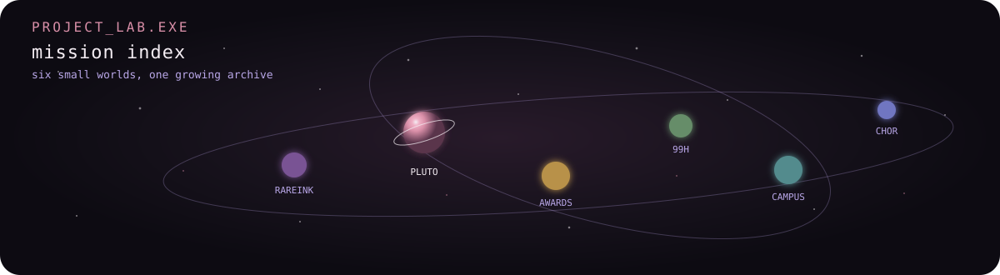
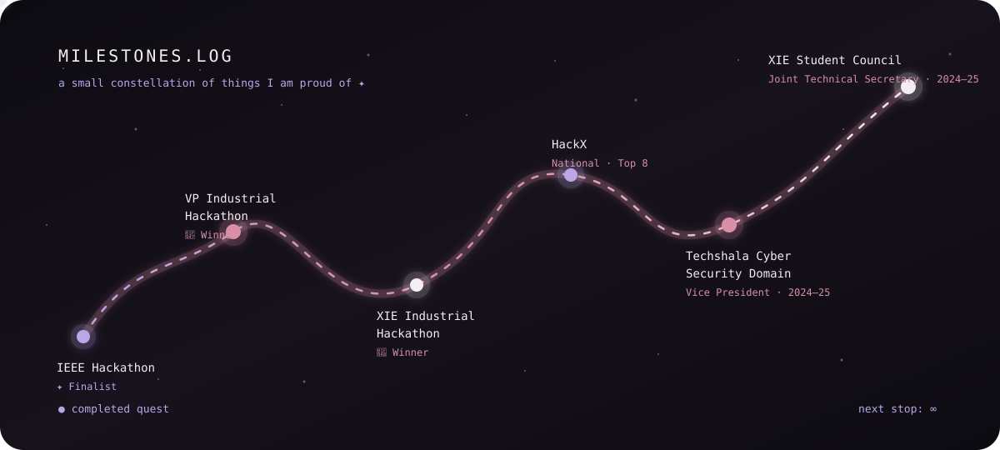

<div align="center">

# ✦ Simran Gorad


### `CS engineer` · `builder of delightfully questionable things` · `Mumbai, India`

<a href="https://readme-typing-svg.demolab.com?font=Fira+Code&weight=500&size=18&duration=2800&pause=900&color=D98FA8&center=true&vCenter=true&width=580&lines=I+turn+%22what+if%3F%22+into+working+software.;Building%2C+learning%2C+and+opening+one+tab+too+many.">
  
</a>

<br>

<a href="https://github.com/Simran-gorad"></a>
<a href="https://www.linkedin.com/in/simran-gorad-87b07a241/"></a>
<a href="https://leetcode.com/u/simrangorad/"></a>

<sub>Ossu! ♡ Welcome to my little corner of the internet.</sub>

</div>


---

## `whoami`

```text
$ whoami

simran-gorad

$ cat about.txt

Computer Science Engineer from Mumbai, India
who likes turning questionable ideas into working software.

I enjoy building across the stack —
from interfaces and frontend experiences
to APIs, databases and the occasional
"wait... can I actually make this work?" project.

$ current_status

● building
● learning
● experimenting
● probably has too many tabs open
```

---

## `// toolkit`

### Languages

<p align="left">
  
  &nbsp;
  
  &nbsp;
  
  &nbsp;
  
  &nbsp;
  
</p>

### Frontend

<p align="left">
  
  &nbsp;
  
  &nbsp;
  
  &nbsp;
  
</p>

### Backend

<p align="left">
  
  &nbsp;
  
  &nbsp;
  
</p>

### Databases

<p align="left">
  
  &nbsp;
  
  &nbsp;
  
</p>

### Tools

<p align="left">
  
  &nbsp;
  
  &nbsp;
  
  &nbsp;
  
</p>

<details>
<summary>🌱 currently exploring</summary>

<br>

AI-assisted development · LLM applications · modern backend architecture

</details>

---

# `PROJECT LAB.exe`

<p align="center">
  
</p>

<table>
  <tr>
    <td width="50%" valign="top">
      <sub><code>MISSION 01</code></sub>
      <h3>Pluto — Desktop Companion</h3>
      A little desktop companion built around a physical pet-robot concept, with AI-assisted voice interaction and system-level controls.
      <br><br>
      <code>JavaScript</code> <code>Node.js</code> <code>Electron</code>
      <br><br>
      <a href="https://github.com/Simran-gorad/Pluto-Desktop-Companion">→ OPEN MISSION</a>
    </td>
    <td width="50%" valign="top">
      <sub><code>MISSION 02</code></sub>
      <h3>Chor Police</h3>
      A two-player chase game with multiple levels, sprite animation, obstacles, health mechanics, timed escape routes, and sound effects.
      <br><br>
      <code>Java</code> <code>Sprite Animation</code> <code>Game Logic</code>
      <br><br>
      <a href="https://github.com/Simran-gorad/Java-2D-Game">→ OPEN MISSION</a>
    </td>
  </tr>
  <tr>
    <td width="50%" valign="top">
      <sub><code>MISSION 03</code></sub>
      <h3>BE-CSE Awards</h3>
      A live awards platform with real-time voting, QR-based participation, admin controls, surge detection, and winner reveals.
      <br><br>
      <code>JavaScript</code> <code>Firebase</code> <code>Realtime Database</code>
      <br><br>
      <a href="https://github.com/Simran-gorad/be-cse-awards">→ OPEN MISSION</a>
    </td>
    <td width="50%" valign="top">
      <sub><code>MISSION 04</code></sub>
      <h3>99Hectors</h3>
      A team-built real-estate web platform inspired by large property marketplaces.
      <br><br>
      <code>HTML</code> <code>CSS</code> <code>JavaScript</code>
      <br><br>
      <a href="https://github.com/TaherAfsar/99Hectors">→ OPEN MISSION</a>
    </td>
  </tr>
  <tr>
    <td width="50%" valign="top">
      <sub><code>MISSION 05</code></sub>
      <h3>RareInk</h3>
      A team project exploring digital collectibles, marketplace interactions, and blockchain-based ownership.
      <br><br>
      <code>Web3</code> <code>Marketplace</code> <code>Team Project</code>
      <br><br>
      <a href="https://github.com/Simran-gorad/RareInk">→ OPEN MISSION</a>
    </td>
    <td width="50%" valign="top">
      <sub><code>MISSION 06</code></sub>
      <h3>Campus Placement</h3>
      A full-stack platform connecting recruiters and students through job listings, applications, and placement workflows.
      <br><br>
      <code>MongoDB</code> <code>Express</code> <code>React</code> <code>Node.js</code>
      <br><br>
      <a href="https://github.com/Simran-gorad/Campus-Placement-Project">→ OPEN MISSION</a>
    </td>
  </tr>
</table>


## `milestones.log`

<p align="center">
  
</p>

---

# `github.log`

<p align="center">
  <a href="https://github.com/Simran-gorad">
    
  </a>
</p>

<details>
<summary>🏅 achievements</summary>

<br>

`nothing unlocked yet...`

*give it time ♡*

</details>

---

# `currently_playing.exe`

<p align="center">
  🎧
  <br>
  <sub>currently listening...</sub>
</p>

<p align="center">
  <i>Spotify integration coming soon ♡</i>
</p>

---

# `connect.sh`

<p align="center">
  wanna build something questionable together?
</p>

<p align="center">
  <a href="https://www.linkedin.com/in/simran-gorad-87b07a241/">
    
  </a>
  &nbsp;&nbsp;&nbsp;
  <a href="https://leetcode.com/u/simrangorad/">
    
  </a>
  &nbsp;&nbsp;&nbsp;
  <a href="https://github.com/Simran-gorad">
    
  </a>
</p>

<p align="center">
  <sub>📍 Mumbai, India</sub>
</p>

---

<p align="center">
  
</p>

<p align="center">
  <sub>you made it to the end. ossu ♡</sub>
</p>

<p align="center">
  <sub><code>$ sudo hire simran</code></sub>
</p>

<p align="center">
  <sub>permission granted ♡</sub>
</p>
